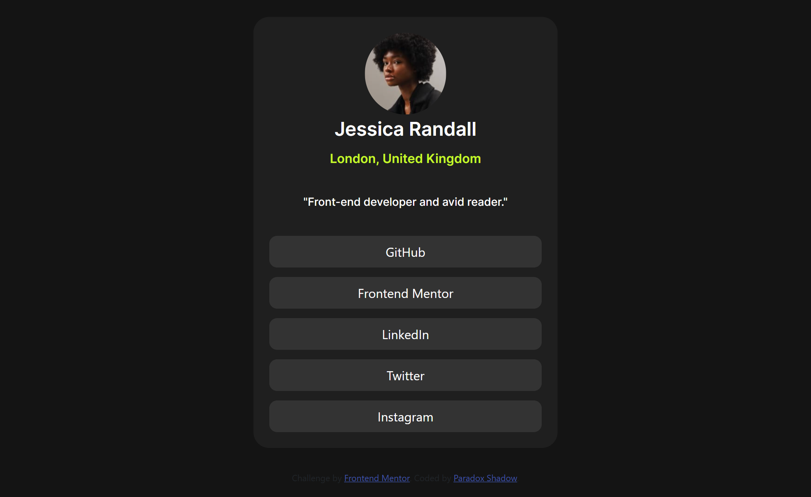

# Frontend Mentor - Social links profile solution

This is my solution for the Social Links Profile Challenge on Frontend Mentor. Through this challenge, I honed my skills in HTML, CSS, and Bootstrap, focusing on structuring a clean, responsive profile component with accessible social link sections.

## Table of contents

- [Overview](#overview)
  - [The challenge](#the-challenge)
  - [Screenshot](#screenshot)
  - [Links](#links)
- [My process](#my-process)
  - [Built with](#built-with)
  - [What I learned](#what-i-learned)
  - [Continued development](#continued-development)
  - [Useful resources](#useful-resources)
- [Author](#author)
- [Acknowledgments](#acknowledgments)

**Note: Delete this note and update the table of contents based on what sections you keep.**

## Overview

### The challenge

Users should be able to:

- See hover and focus states for all interactive elements on the page

### Screenshot



Add a screenshot of your solution. The easiest way to do this is to use Firefox to view your project, right-click the page and select "Take a Screenshot". You can choose either a full-height screenshot or a cropped one based on how long the page is. If it's very long, it might be best to crop it.

Alternatively, you can use a tool like [FireShot](https://getfireshot.com/) to take the screenshot. FireShot has a free option, so you don't need to purchase it. 

Then crop/optimize/edit your image however you like, add it to your project, and update the file path in the image above.


### Links

- Solution URL: [Add solution URL here](https://github.com/Taresta/Social-Links-Profile.git)
- Live Site URL: [Add live site URL here](https://taresta.github.io/Social-Links-Profile/)

## My process

### Built with

- Semantic HTML5: for accessible and clear markup.
- CSS custom properties: to maintain consistent theming.
- Bootstrap 5: for the grid and responsive design utilities.
- Flexbox & CSS Grid: for layout management, with a mobile-first workflow.


### What I learned

Through this project, I solidified my understanding of Bootstrap’s grid system, particularly how to manage gaps and spacing between elements effectively without relying on redundant HTML structure. 

```html
<section id="social-links" aria-label="Social Links">
  <a href="#" class="link GitHub">GitHub</a>
</section>
```
```css
#social-links .link {
  display: block;
  padding: 12px;
  border-radius: 10px;
  background-color: var(--grey-700);
}
```

### Continued development

Moving forward, I aim to deepen my expertise in:

- CSS Transitions and Animations: Adding subtle interactivity to improve user experience.
- Responsive Design Patterns: Optimizing for diverse device screens more effectively.
- Bootstrap’s Advanced Features: Utilizing more complex components and customizations within Bootstrap to enhance projects.

### Useful resources

- [Bootstrap Documentation](https://getbootstrap.com/) - Extremely helpful for understanding and utilizing Bootstrap’s grid system effectively.
- [MDN Web Docs - CSS Custom Properties](https://developer.mozilla.org/en-US/docs/Web/CSS/--*)- Provided clarity on using CSS custom properties efficiently.

## Author

- Website - [Paradox Shadow](https://github.com/Taresta/)
- Frontend Mentor - [Paradox](https://www.frontendmentor.io/home)

## Acknowledgments
 Thanks by coding buddy. You are the best!